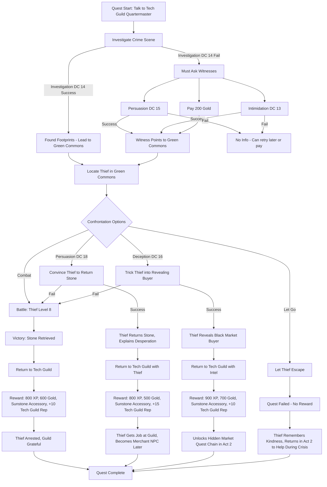

# Solar Punk Chronicles: Master Game Design Document
**Version 1.0** | **Lead Designer** | **Last Updated: 2025-11-01**

---

## Table of Contents

1. [Executive Summary](#1-executive-summary)
2. [Core Gameplay Loop](#2-core-gameplay-loop)
3. [Game Systems Design](#3-game-systems-design)
   - 3.1 [World Map Navigation](#31-world-map-navigation)
   - 3.2 [City Exploration](#32-city-exploration)
   - 3.3 [Combat System](#33-combat-system)
   - 3.4 [Character Progression](#34-character-progression)
   - 3.5 [Unit Unlocking](#35-unit-unlocking)
   - 3.6 [Equipment and Inventory](#36-equipment-and-inventory)
4. [Narrative Framework](#4-narrative-framework)
5. [Progression and Balancing](#5-progression-and-balancing)
6. [UI/UX Design](#6-uiux-design)
7. [Technical Implementation Notes](#7-technical-implementation-notes)
8. [Development Roadmap](#8-development-roadmap)

---

## 1. Executive Summary

### 1.1 Vision Statement

**Solar Punk Chronicles** is a hybrid turn-based RPG that merges the tactical depth of Final Fantasy with D&D-style skill checks and exploration, set in an optimistic solarpunk future. Players build and manage a party of unique characters, exploring interconnected cities via a Super Mario 3-style world map, engaging in tactical battles, and solving problems through multiple skill-based approaches.

The game emphasizes **hope, community, and human ingenuity** over dystopian cynicism, presenting a world where technology and nature coexist harmoniously. Every character has a story, every battle feels impactful, and player choices shape both narrative and gameplay outcomes.

### 1.2 Unique Selling Points

1. **Solarpunk Setting**: A rare, optimistic sci-fi aesthetic focusing on sustainability, community, and vibrant color palettes
2. **Triple-Layer Design**: Seamless transitions between world map strategy, city exploration, and tactical combat
3. **D&D-Inspired Exploration**: Skill checks (Investigation, Persuasion, Stealth, etc.) provide multiple solutions to every challenge
4. **Hades-Style Evolution**: 3-card choice system for character progression creates meaningful decisions and build variety
5. **6-Character Tactical Combat**: Final Fantasy-style left-to-right battles with formation mechanics and combo potential
6. **Multiple XP Sources**: Combat, exploration, events, and equipment all contribute to progression, rewarding diverse playstyles
7. **Character-Driven Narrative**: Humor, personality, and growth arcs for party members with meaningful character interactions
8. **Web-Native Design**: Zero-touch development workflow, instant accessibility, no installation required

### 1.3 Core Pillars

**Pillar 1: Meaningful Choice**
- Every encounter offers multiple solution paths (combat, stealth, social, magic, environmental)
- Skill checks determine available options, rewarding character specialization
- Consequences persist and affect future interactions

**Pillar 2: Satisfying Progression**
- Visible power growth through levels, abilities, and equipment
- 3-card evolution system creates exciting decision points
- Multiple progression paths (XP, gear, relationships, discoveries)

**Pillar 3: Impactful Combat**
- Strong visual and audio feedback for every action
- Formation and positioning matter tactically
- "Game juice" principles: screen shake, particle effects, damage numbers, satisfying sound design

**Pillar 4: Hopeful Narrative**
- Solarpunk themes: community solutions, sustainable technology, cooperation
- Characters with distinct personalities and growth arcs
- Humor balances serious moments, preventing grimdark tone

### 1.4 Target Audience

**Primary**: RPG enthusiasts aged 25-40 who enjoy tactical depth, character progression, and narrative-driven games
**Secondary**: Indie game players seeking fresh settings and unique aesthetics
**Tertiary**: Web game players looking for accessible, session-based experiences

### 1.5 Comparable Games

- **Tactical Combat**: Final Fantasy Tactics Advance, Into the Breach
- **Exploration**: Baldur's Gate 3, Disco Elysium
- **Progression**: Hades, Slay the Spire
- **Aesthetic**: Haven, Cloudpunk (but more optimistic)

---

## 2. Core Gameplay Loop

### 2.1 Macro Loop (Session-to-Session)

```
START SESSION
    ↓
Select Destination on World Map
    ↓
Travel to City/Location
    ↓
Explore City (Investigation, NPCs, Quests)
    ↓
Encounter Event/Combat/Challenge
    ↓
Make Skill Checks / Fight Battle
    ↓
Gain XP, Items, and Story Progress
    ↓
Level Up → Choose Evolution Cards
    ↓
Rest and Party Management
    ↓
Return to World Map or Continue Exploring
    ↓
LOOP or END SESSION
```

**Session Length**: 30-60 minutes
**Save Points**: Automatic between major activities, manual at rest points

### 2.2 Micro Loop (Combat)

```
BATTLE START
    ↓
Calculate Initiative (Speed-based turn order)
    ↓
Character's Turn Begins
    ↓
Choose Action:
  - Attack (Single/Multi-target)
  - Skill (Special abilities, SP cost)
  - Defend (Reduce damage, gain resource)
  - Item (Consumables)
  - Formation (Reposition party)
    ↓
Select Target(s)
    ↓
Execute Action with Animation
    ↓
Resolve Damage/Effects
    ↓
Check for Status Effects
    ↓
Enemy Turn (AI-controlled)
    ↓
Check Win/Loss Conditions
    ↓
If Battle Continues → Next Character Turn
If Victory → Rewards Screen (XP, Items, Gold)
If Defeat → Retry Options
```

**Battle Duration**: 3-7 minutes
**Engagement**: Every turn matters, no filler rounds

### 2.3 Micro Loop (Exploration)

```
ENTER NEW AREA
    ↓
Passive Perception Checks (automatic)
  - Spot hidden paths, secrets, NPCs
    ↓
Investigate Points of Interest
    ↓
Trigger Active Skill Check
  - Player chooses which character attempts
  - Roll d20 + Skill Modifier vs. DC
  - Success/Failure paths branch
    ↓
Interact with NPCs
  - Dialogue choices
  - Social skill checks (Persuasion, Deception, Intimidation)
    ↓
Trigger Events:
  - Cutscenes
  - Quest updates
  - Combat encounters
  - Item discoveries
    ↓
Update Quest Log and Flags
    ↓
Continue Exploration or Return to World Map
```

**Exploration Pacing**: Mix of directed objectives and optional discoveries
**Hidden Content**: Rewards passive perception and investigation skills

### 2.4 XP and Reward Flow

**XP Sources** (all contribute to leveling):
1. **Combat Victories** (40% of total XP): Enemy difficulty scales rewards
2. **Skill Check Successes** (30%): Investigation, social, stealth challenges
3. **Quest Completion** (20%): Story beats and side missions
4. **Discovery Bonuses** (10%): Finding secrets, unlocking new characters

**Reward Distribution**:
- **Immediate**: Gold, consumable items, equipment drops
- **Short-term**: XP bar progress, skill unlocks
- **Long-term**: New party members, story revelations, world map unlocks

---

## 3. Game Systems Design

### 3.1 World Map Navigation

**Visual Style**: Super Mario 3 / Fire Emblem world map
- **Isometric/Top-Down**: Clear path connections between nodes
- **Art Style**: Hand-drawn aesthetic with solarpunk environmental details (solar panels, green roofs, wind turbines, vertical gardens)
- **Color Palette**: Vibrant greens, blues, warm yellows, accented with technological purples and cyans

**Map Structure**:

```
[START: Heliosa City]
         ↓
    [Green Transit Hub] (tutorial area)
         ↓
    [Branch Point]
    /          \
[Verdant      [Solar
 Gardens]      Nexus]
    \          /
    [Convergence]
         ↓
    [Industrial
     Reclaim]
         ↓
    [End Game Locations...]
```

**Node Types**:
1. **Cities** (Major Hubs): Multiple exploration areas, shops, quests, party members
2. **Transit Points** (Safe Zones): Rest, fast travel unlock points, minor NPCs
3. **Event Nodes** (Challenges): Single encounters, puzzles, mini-quests
4. **Discovery Nodes** (Optional): Hidden paths revealed by skills or story progress
5. **Boss Nodes** (Climactic): Story-critical battles, unique mechanics

**Navigation Mechanics**:

**Movement**:
- Click/tap node to select destination
- Avatar moves along connecting paths
- Travel is instant (no real-time movement between nodes)
- Can return to previous locations freely after visiting once

**Unlock Progression**:
- **Linear Start**: First 3-4 locations are fixed path (tutorial progression)
- **Branching Mid-Game**: Multiple paths become available, player chooses exploration order
- **Convergent Design**: Paths merge before major story beats to ensure proper pacing
- **Optional Secrets**: Hidden nodes revealed through:
  - High Perception checks in connected areas
  - Quest completion rewards
  - Story progression flags
  - Purchased maps from merchants

**World Map UI Elements**:

| Element | Location | Information |
|---------|----------|-------------|
| **Party Display** | Top-Left | Current active party (portraits, HP bars) |
| **Resources** | Top-Right | Gold, Consumables count |
| **Quest Tracker** | Right Side | Active objectives, distance to goal |
| **Location Info** | Bottom | Name, level recommendation, completion status |
| **Map Legend** | Bottom-Left | Icon meanings (shop, quest, boss, etc.) |

**Location Indicators**:
- **Incomplete**: Pulsing icon, "NEW" flag
- **In Progress**: Yellow border, quest count
- **Completed**: Checkmark, grayed (but still accessible)
- **Recommended Level**: Color-coded danger level (Green = safe, Yellow = challenging, Red = difficult)

**Environmental Storytelling on World Map**:
- Visible changes after completing major quests (structures built, paths cleared, greenery spreads)
- Dynamic weather reflecting game progression
- Background animations (wind turbines spinning, trains moving, airships passing)

### 3.2 City Exploration

**Visual Style**: Fire Emblem hub meets Baldur's Gate 3 exploration
- **Perspective**: Isometric 3/4 view
- **Movement**: Click-to-move or WASD controls, grid-based pathfinding
- **Camera**: Rotatable (90° increments) to see behind buildings

**City Structure**:

Each city contains multiple districts, approximately 5-8 interconnected areas:

**Example: Heliosa City (Starting Area)**
1. **Central Plaza**: Main quest NPCs, bulletin board, fast travel point
2. **Market District**: Shops (equipment, consumables, misc items), merchant NPCs
3. **Residential Quarter**: Character recruitment, side quests, rest inn
4. **Tech Workshop**: Upgrade station, crafting, engineer NPCs
5. **Green Commons**: Park area with secrets, environmental puzzles
6. **Transit Terminal**: Exit to world map, optional combat arena
7. **Hidden Undercity** (optional): Unlocked via investigation, contains secrets and tough encounters

**Exploration Mechanics**:

**Passive Perception (Automatic)**:
- Formula: `10 + Perception Modifier + Bonuses`
- Triggers when player enters detection radius of hidden objects
- Examples:
  - DC 12: Spot glinting item on ground
  - DC 15: Notice suspicious NPC behavior
  - DC 18: Detect hidden door seams
  - DC 20: Hear whispered conversation through walls

**Active Investigation (Player-Initiated)**:
- Player clicks "Investigate" on interactive object
- Choose which party member attempts check
- Roll: `d20 + Investigation Modifier` vs. DC
- **Success Tiers**:
  - **Critical Success (Nat 20 or beat DC by 10+)**: Discover additional secret, bonus reward
  - **Success**: Achieve intended result
  - **Failure**: Miss discovery, but can retry with different character or after gaining clues
  - **Critical Failure (Nat 1)**: Trigger trap, alert guards, or create complication

**Skill Check Integration**:

Following D&D 5e skill system with 6 ability scores and associated skills:

| Ability | Skills | Exploration Uses |
|---------|--------|------------------|
| **Strength** | Athletics | Climb buildings, force doors, move obstacles |
| **Dexterity** | Acrobatics, Sleight of Hand, Stealth | Balance on ledges, pickpocket, lockpick, sneak past guards |
| **Constitution** | (Direct stat) | Resist environmental hazards, drinking contests (social events) |
| **Intelligence** | Arcana, History, Investigation, Nature, Religion | Analyze tech, recall lore, find clues, identify plants, understand rituals |
| **Wisdom** | Animal Handling, Insight, Medicine, Perception, Survival | Calm creatures, detect lies, heal wounds, spot secrets, track targets |
| **Charisma** | Deception, Intimidation, Performance, Persuasion | Lie convincingly, threaten enemies, distract with performance, negotiate deals |

**Multi-Solution Design Template**:

Every significant challenge should have **at least 3 solution paths**:

**Example Scenario: "Gain Access to Restricted Tech Lab"**

| Approach | Required Skills | Consequences |
|----------|----------------|--------------|
| **Combat** | Fight guards directly | Loud, raises alarm, potential reinforcements, guards remember you |
| **Stealth** | Stealth DC 15, Lockpicking DC 13 | Quiet, no alarm, but limited time before patrol returns |
| **Social - Persuasion** | Persuasion DC 18, look legitimate | Guards let you in, full access, but they expect you to leave soon |
| **Social - Deception** | Deception DC 16, forged credentials | Entry granted, but if discovered later, faction reputation drops |
| **Social - Intimidation** | Intimidation DC 14, imposing presence | Guards step aside but harbor resentment, may ambush later |
| **Magic** | Spell: Invisibility or Charm Person | Uses spell slot resource, time-limited effect |
| **Environmental** | Investigation DC 17 to find vent system | Requires Athletics DC 12 to crawl through, bypasses all guards |
| **Knowledge** | History DC 14 to know architect, find maintenance entrance | Cleanest entry, NPCs impressed by knowledge |

**NPC Interaction System**:

**Dialogue Structure**:
- **Branching Trees**: 3-5 response options per dialogue node
- **Skill-Gated Options**: Special dialogue choices appear when character has relevant skill proficiency
  - Example: [Perception 15+] "I notice you keep glancing at the door. Expecting trouble?"
- **Personality Consistency**: Responses reflect character traits (Brash fighter has different options than diplomatic scholar)
- **Consequence Tracking**: NPCs remember past interactions, reference previous conversations
- **Timed Responses** (optional critical moments): 10-second timer for dramatic choices

**NPC Memory System**:
```javascript
NPC_State = {
  relationship: -100 to +100, // Affects prices, quest availability, dialogue tone
  knownFacts: ['player_helped_friend', 'player_refused_bribe'],
  lastInteraction: timestamp,
  questsGiven: ['main_quest_01', 'side_quest_03'],
  favorsDone: 2
}
```

**City Events and Triggers**:

**Event Types**:
1. **Scripted Events**: Story-critical, trigger on first visit or quest progression
2. **Random Encounters**: Low percentage chance when entering certain areas (5-15%)
3. **Time-Based Events**: NPCs have schedules, different interactions morning/evening
4. **Conditional Events**: Unlock based on party composition, skill levels, or story flags

**Event Triggers**:
```javascript
EventTrigger = {
  id: 'market_chase_01',
  location: 'heliosa_market',
  triggerType: 'zone_entry', // or 'npc_dialogue', 'item_use', 'time'
  conditions: {
    questFlag: 'main_quest_02_active',
    minLevel: 3,
    visitCount: 1, // First time in this area during quest
    timeOfDay: 'afternoon'
  },
  once: true, // Only trigger once ever
  priority: 'high' // Interrupts current action
}
```

### 3.3 Combat System

**Battle Perspective**: Final Fantasy VI-style side view
- **Party Position**: Left side of screen, facing right
- **Enemy Position**: Right side of screen, facing left
- **Camera**: Mostly static with dynamic zooms and shakes for impact

**Party Formation System**:

**6-Character Party Composition**:
- **Active Party**: 4 characters on battlefield
- **Reserve**: 2 characters in reserve (can swap during battle)

**Formation Layout** (Rows affect mechanics):

```
         FRONT ROW          BACK ROW
       [Position 1]        [Position 3]
       [Position 2]        [Position 4]
```

**Row Mechanics**:
- **Front Row**:
  - Deals 100% physical damage
  - Takes 100% physical damage
  - Can use melee and ranged attacks
  - Cannot be targeted by ranged attacks while back row members are alive (unless ability specifies)

- **Back Row**:
  - Deals 50% physical damage with non-ranged weapons
  - Takes 50% physical damage
  - Deals 100% ranged and magic damage
  - Takes 100% magical damage
  - Must be targeted first by most ranged attacks

**Pre-Set Formations**:

| Formation | Layout | Bonuses | Best For |
|-----------|--------|---------|----------|
| **Balanced** | 2 Front / 2 Back | +5% all damage | General use |
| **Defensive** | 1 Front / 3 Back | +10 DEF all characters, -5% damage | Surviving tough encounters |
| **Aggressive** | 3 Front / 1 Back | +15% damage, -10 DEF | Burst damage strategies |
| **Magic Focus** | 1 Front / 3 Back | +10% magic damage, +10% MP regen | Caster-heavy parties |
| **Skirmish** | 2 Front / 2 Back (split positions) | +5 SPD all characters | Speed-based teams |

**Can change formation between battles or spend a turn in combat (cost: 1 action)**

**Turn Order System**:

**Initiative Calculation**:
```
Initiative = d20 + Speed Modifier + Bonuses
```

**Speed Modifier Formula**:
```
Speed Modifier = (Speed Stat - 10) / 2
Speed Stat Range: 8-20 (average: 12-14)
Example: Speed 16 = +3 modifier
```

**Turn Order Display**:
- Visual bar at top of screen showing upcoming turns
- Character portraits in order (next 10 turns visible)
- Current turn highlighted
- Allows tactical planning ("Enemy mage goes in 2 turns, I should interrupt with a stun now")

**Action Economy**:

Each character's turn consists of:

**1 Standard Action** (choose one):
- **Attack**: Weapon or unarmed strike
- **Skill**: Special ability (SP cost)
- **Defend**: Reduce incoming damage by 50%, gain 1 SP, gain 10% Overdrive
- **Item**: Use consumable from inventory
- **Swap**: Switch with reserve party member (ends turn)

**1 Free Action** (optional):
- **Movement**: Change row (Front ↔ Back)
- **Quick Item**: Use specific items marked "Quick" (e.g., potions of self-targeting)

**Reaction** (triggered automatically or by setting):
- **Opportunity Counter**: When enemy misses, chance to counterattack (requires perk)
- **Covering Ally**: Tank intercepts attack aimed at weak ally (requires specific ability)
- **Spell Shield**: Cast defensive spell when ally takes magic damage (requires ability)

**Combat Statistics**:

**Primary Stats**:
- **HP (Hit Points)**: Health pool, 0 = KO'd
- **SP (Skill Points)**: Resource for abilities, regenerates 10% per turn, full restore out of combat
- **Overdrive Gauge**: 0-100%, builds from dealing/receiving damage, enables ultimate abilities at 100%

**Offensive Stats**:
- **ATK (Attack)**: Physical damage output
  - Formula: `Weapon Base Damage + (ATK Stat / 2)`
  - Example: Sword (30 base) + ATK 50 = 30 + 25 = 55 damage before defense

- **MAG (Magic)**: Magic damage output
  - Formula: `Spell Base Damage + (MAG Stat / 2)`

- **HIT (Accuracy)**: Chance to hit (95% base - enemy evasion)
  - Formula: `95% + (Accuracy Stat - Enemy Evasion)`

**Defensive Stats**:
- **DEF (Defense)**: Physical damage reduction
  - Formula: `Damage Taken = Max(1, Incoming Damage - DEF)`
  - Example: 55 incoming damage - 20 DEF = 35 damage taken

- **RES (Resistance)**: Magic damage reduction (same formula as DEF)

- **EVA (Evasion)**: Dodge chance (5% base)
  - Formula: `Dodge Chance = 5% + (Evasion Stat / 2)%`
  - Example: EVA 10 = 5% + 5% = 10% dodge chance

**Speed**:
- **SPD**: Determines turn order initiative
- Higher SPD = more turns relative to slow enemies

**Damage Calculation Formula**:

**Physical Damage**:
```
1. Base Damage = Weapon Base + (ATK / 2)
2. Critical Check = d20, if ≥18, damage × 1.5
3. Hit Check = d20 + HIT vs. (10 + Enemy EVA)
4. If Hit:
   Final Damage = Max(1, Base Damage - Enemy DEF) × Row Modifier × Elemental Modifier
5. If Miss: Display "MISS!"
```

**Magical Damage**:
```
1. Base Damage = Spell Base + (MAG / 2)
2. Critical Check = d20, if ≥19, damage × 1.3 (magic crits less)
3. Magic Always Hits (no evasion check)
4. Final Damage = Max(1, Base Damage - Enemy RES) × Elemental Modifier
```

**Elemental System**:

**Elements**: Fire, Water, Earth, Wind, Lightning, Light, Dark, Neutral

**Effectiveness Multipliers**:
- **Weak**: 1.5× damage
- **Neutral**: 1.0× damage
- **Resist**: 0.5× damage
- **Immune**: 0× damage (No Effect!)
- **Absorb**: Heals target (rare)

**Element Wheel** (strengths):
```
Fire → Wind → Earth → Lightning → Water → Fire
(Fire strong against Wind, weak to Water)

Light ↔ Dark (mutual weakness)
Neutral: No strengths/weaknesses
```

**Status Effects**:

| Status | Effect | Duration | Can Stack? |
|--------|--------|----------|------------|
| **Poison** | -5% Max HP per turn | 3 turns | No |
| **Burn** | -10% Max HP per turn, -10% ATK | 2 turns | No |
| **Freeze** | Cannot act, DEF -50% | 1 turn | No |
| **Paralyze** | 50% chance to lose turn | 2 turns | No |
| **Sleep** | Cannot act, wakes if hit | 3 turns or until hit | No |
| **Blind** | -50% accuracy | 3 turns | No |
| **Silence** | Cannot use magic/skills | 2 turns | No |
| **Slow** | -50% SPD, acts less often | 3 turns | No |
| **Haste** | +50% SPD, acts more often | 3 turns | No |
| **Regen** | Restore 5% Max HP per turn | 5 turns | No |
| **Barrier** | +50% DEF | 3 turns | No |
| **Shell** | +50% RES | 3 turns | No |
| **Berserk** | ATK +30%, cannot control | 3 turns | No |

**Status Resistance**: Each character has different resistances (0-100%)
- Formula: `Status Lands if d100 > Character Resistance`
- Example: Character has 30% Poison Resistance, Poison lands if roll > 30

**Combo System**:

**Element Combos** (trigger when same element hits same target twice in same turn):
- **Fire + Fire = Inferno**: +50% damage on second hit, AoE splash to adjacent enemies
- **Water + Water = Deluge**: +30% damage, Slow status applied
- **Lightning + Lightning = Overcharge**: +70% damage, Paralyze chance 50%
- **Earth + Earth = Earthquake**: +40% damage, hits all grounded enemies for 50% damage
- **Wind + Wind = Cyclone**: +30% damage, pushes enemy back a row

**Position Combos** (specific character positions enable team attacks):
- **Positions 1+2 (Front Row Adjacent)**: "Twin Strike" - Both attack same enemy, second attack +20% damage
- **Positions 3+4 (Back Row Adjacent)**: "Arcane Resonance" - Magic attacks +15% damage when both cast same element
- **Positions 1+3 (Vertical Alignment)**: "Cover Fire" - Position 3 attack grants Position 1 free counterattack chance
- **All 4 Active**: "Limit Break" - Once per battle, all characters act simultaneously, Overdrive gauges combine

**Enemy AI Behavior Types**:

1. **Aggressive**: Always targets lowest HP character, high damage output
2. **Tactical**: Targets weaknesses (low DEF character with physical, low RES with magic), uses buffs
3. **Defensive**: Buffs self, heals allies, targets threats (high damage characters)
4. **Chaotic**: Random targeting, unpredictable ability use, wild card
5. **Boss AI**: Multi-phase scripting, responds to HP thresholds, uses signature abilities strategically

**Boss Mechanics**:

**Phase System**:
```javascript
Boss_HP_Phases = {
  100-75%: {behavior: 'phase1', abilities: ['attack', 'buff_self', 'single_target_skill']},
  74-50%: {behavior: 'phase2', abilities: ['stronger_attacks', 'aoe_skill', 'summon_adds']},
  49-25%: {behavior: 'phase3', abilities: ['ultimate_skill', 'desperation_attacks', 'status_spam']},
  24-0%: {behavior: 'enrage', abilities: ['all_strongest_abilities', 'remove_cooldowns']}
}
```

**Boss Unique Mechanics**:
- **Interrupt Windows**: Vulnerable state when performing charge-up attack (cancel with stagger skills)
- **Adds Management**: Summons minions that must be dealt with or provide buffs to boss
- **Environmental Hazards**: Boss triggers battlefield changes (fire zones, lightning strikes)
- **Scripted Events**: Mid-battle cutscenes, forced character swaps, special conditions

**Battle Victory Conditions**:
1. **Standard**: Defeat all enemies
2. **Survival**: Last X turns
3. **Protection**: Keep NPC alive
4. **Escape**: Reduce enemy HP to threshold, then flee
5. **Puzzle**: Solve environmental mechanic while fighting

**Battle Defeat Conditions**:
1. **Party Wipe**: All active party members reach 0 HP
2. **Objective Failure**: Protected NPC dies, timer expires
3. **Special Conditions**: Story-scripted unwinnable battles (triggers cutscene)

**Defeat Options**:
- **Retry**: Restart battle with full HP/SP/items (no penalty)
- **Retry with Easy Mode**: Enemy stats reduced by 25% for this battle only
- **Return to World Map**: Forfeit battle, return to last safe point (lose progress in dungeon if applicable)

**Battle Rewards**:

**XP Distribution**:
```
Base XP = Enemy Level × 10 × Enemy Count
Bonuses:
- No KOs: +20% XP
- Overkill (finish with limit break): +10% XP
- Fast Clear (<5 turns): +15% XP
- Skill Use Bonus: +5 XP per unique skill used
- Status Effect Mastery: +10 XP if used status effects effectively

Final XP = Base × Bonuses, split among active party members (reserves get 50%)
```

**Loot Drops**:
- **Guaranteed**: Gold (formula: `Enemy Level × 50 + Random(0-100)`)
- **Common** (60% chance): Consumables (potions, status cures)
- **Uncommon** (30% chance): Equipment pieces (weapons, armor)
- **Rare** (10% chance): Crafting materials, special items
- **Boss Guaranteed**: Unique equipment or key item

**Post-Battle Screen Flow**:
```
Victory Fanfare (2 seconds)
    ↓
XP Gain Animation (numbers count up)
    ↓
Level Up Notifications (if applicable)
    ↓
Loot Display (items appear with rarity glow)
    ↓
Gold Gained
    ↓
Return to Exploration or World Map
```

### 3.4 Character Progression

**Leveling Curve**:

**XP Requirements**:
```
XP to Next Level = 100 × Current Level × (1 + (Current Level / 10))

Examples:
Level 1 → 2: 110 XP
Level 2 → 3: 240 XP
Level 5 → 6: 600 XP
Level 10 → 11: 2,100 XP
Level 20 → 21: 8,400 XP
```

**Max Level**: 30 (endgame scaling allows reaching ~Level 25-28 through normal play, Level 30 requires completion content)

**Level Up Bonuses**:

**Automatic Stat Gains per Level**:
```javascript
StatGrowth = {
  HP: +BaseHP × (0.08 to 0.12), // Varies by class archetype
  SP: +BaseSP × 0.05,
  ATK: +2 to +4 (fighters higher, mages lower),
  MAG: +2 to +4 (mages higher, fighters lower),
  DEF: +1 to +3,
  RES: +1 to +3,
  SPD: +1 to +2
}
```

**Class Archetypes** (affects growth rates):

| Archetype | HP Growth | ATK Growth | MAG Growth | DEF Growth | RES Growth | SPD Growth |
|-----------|-----------|------------|------------|------------|------------|------------|
| **Fighter** | High (12%) | High (+4) | Low (+2) | High (+3) | Low (+1) | Medium (+2) |
| **Tank** | Very High (15%) | Medium (+3) | Low (+2) | Very High (+4) | Medium (+2) | Low (+1) |
| **Rogue** | Medium (10%) | Medium (+3) | Low (+2) | Low (+1) | Low (+1) | Very High (+3) |
| **Mage** | Low (8%) | Low (+2) | Very High (+5) | Low (+1) | High (+3) | Medium (+2) |
| **Cleric** | Medium (10%) | Low (+2) | High (+4) | Medium (+2) | Very High (+4) | Medium (+2) |
| **Hybrid** | Medium (10%) | Medium (+3) | Medium (+3) | Medium (+2) | Medium (+2) | Medium (+2) |

**Hades-Style 3-Card Evolution System**:

**Trigger**: Every level up presents 3 randomly selected evolution options

**Card Types**:

1. **Stat Boost Cards** (40% chance):
   - **Vigorous Training**: +15 HP, +2 ATK
   - **Arcane Studies**: +10 SP, +3 MAG
   - **Iron Body**: +5 DEF, +5 RES
   - **Swift Reflexes**: +3 SPD, +2 EVA
   - **Balanced Growth**: +5 HP, +1 to all stats

2. **New Ability Cards** (35% chance):
   - Grants a new combat skill
   - Costs SP to use in battle
   - Examples:
     - **Flame Strike**: 30 SP, 150% ATK fire damage, single target
     - **Healing Wave**: 25 SP, restore 40% HP, single ally
     - **Thunder Chain**: 40 SP, lightning damage to enemy + 2 adjacent
     - **Shield Wall**: 20 SP, +50% DEF to all allies, 2 turns
     - **Quick Strike**: 15 SP, 80% ATK damage, instant turn (doesn't consume turn order position)

3. **Passive Perk Cards** (20% chance):
   - Permanent passive bonuses
   - Examples:
     - **Critical Eye**: +10% critical hit chance
     - **Elemental Affinity (Fire)**: +20% fire damage, -10% fire damage taken
     - **Mana Conservation**: Skills cost -10% SP
     - **Second Wind**: Restore 10% HP when dropping below 30% HP (once per battle)
     - **Evasion Mastery**: +5% evasion, can dodge magical attacks

4. **Upgrade Existing Ability Cards** (5% chance, requires existing skill):
   - Improves a skill already owned
   - Examples:
     - **Flame Strike II**: Damage 150% → 200%, SP cost 30 → 35
     - **Healing Wave+**: Restore 40% → 60% HP, can target 2 allies
     - **Thunder Chain Max**: Hits 2 adjacent → all enemies, damage slightly reduced

**Card Selection Logic**:
```javascript
function generateEvolutionCards(character, level) {
  const cards = [];

  // Roll for card types
  for (let i = 0; i < 3; i++) {
    const roll = random(0, 100);

    if (roll < 40) {
      cards.push(selectRandomStatBoostCard());
    } else if (roll < 75) {
      cards.push(selectRandomNewAbilityCard(character.class, character.abilities));
    } else if (roll < 95) {
      cards.push(selectRandomPassivePerkCard(character.perks));
    } else {
      if (character.abilities.length > 0) {
        cards.push(selectRandomUpgradeCard(character.abilities));
      } else {
        cards.push(selectRandomNewAbilityCard(character.class, character.abilities)); // Fallback
      }
    }
  }

  // Ensure variety (no duplicate cards)
  return removeDuplicates(cards);
}
```

**Skill Weights by Class**:
Each class has weighted lists to ensure thematic consistency:
- Fighters: Higher chance for physical attack skills and defensive perks
- Mages: Higher chance for elemental spells and magic perks
- Rogues: Higher chance for speed skills and evasion perks
- Clerics: Higher chance for healing/support and resistance perks

**Evolution Choice UI**:
- Display all 3 cards simultaneously
- Hover shows detailed description, stat changes, ability preview
- 60-second timer (can disable in options for accessibility)
- Cannot undo selection after choosing

**Skill Limit**: Maximum 8 active abilities + unlimited passives per character
- When learning 9th ability, must replace one existing skill
- Encourages build variety and specialization

**Build Archetypes** (examples):

**Fighter "Berserker" Build**:
```
Focus: Maximum physical damage, risk/reward gameplay

Key Cards:
- Vigorous Training (×3): Stack ATK and HP
- Power Strike: 200% damage single hit
- Reckless Abandon (passive): +30% damage, -20% DEF
- Critical Eye (passive): +10% crit chance
- Bloodlust (passive): +5% damage per 10% missing HP

Playstyle: Front row aggressive, high damage but risky
```

**Mage "Elementalist" Build**:
```
Focus: Multi-element coverage, exploit weaknesses

Key Cards:
- Arcane Studies (×2): Stack MAG and SP
- Flame Strike: Fire damage
- Thunder Chain: Lightning AoE
- Frost Lance: Water single target
- Elemental Synergy (passive): Using different elements in same turn grants +20% damage
- Mana Conservation (passive): -10% SP costs

Playstyle: Back row, switch elements based on enemy weaknesses, combo setup
```

**Cleric "Paladin" Build**:
```
Focus: Hybrid offense/support, front-line healer

Key Cards:
- Balanced Growth (×2): Even stat distribution
- Holy Strike: Light damage + heal self for 20% damage dealt
- Healing Wave: Restore ally HP
- Divine Shield: Grant ally barrier
- Martyr's Resolve (passive): When ally drops below 20% HP, auto-heal them for 30%
- Iron Body (×1): Boost defenses

Playstyle: Front row, sustain party while dealing damage
```

**Prestige System** (Post-Level 30):
After reaching max level, characters can continue earning XP to unlock:
- **Prestige Points**: 1 per 10,000 XP after Level 30
- **Prestige Shop**: Spend points on ultra-rare cards not available during normal leveling
- **Cosmetic Unlocks**: Alternate character portraits, combat animations, titles

### 3.5 Unit Unlocking and Management

**Party Size**:
- Maximum roster: 12 characters
- Active party: 6 (4 in battle, 2 in reserve)
- Bench: 6 (can swap with active party at rest points)

**Character Recruitment Methods**:

1. **Story Recruitment** (4 characters - core party):
   - Automatically join during main quest progression
   - Fully voice-acted recruitment scenes
   - Examples: Tutorial companion, city leader ally, reformed antagonist

2. **Quest Recruitment** (4 characters):
   - Complete side quest chains (3-5 quests per character)
   - Final quest is character's personal arc resolution
   - Player choice in quest affects character's starting build/personality

3. **Exploration Recruitment** (2 characters):
   - Hidden in optional areas
   - Require high skill checks to access (e.g., Perception DC 20 to spot hidden cave)
   - Most powerful base stats but join at current party level -2

4. **Challenge Recruitment** (2 characters):
   - Defeat in optional boss fight
   - Join party after being bested
   - High difficulty encounters (recommended Level +5)

**Character Unlock Progression Curve**:
```
Character 1: Level 1 (tutorial)
Character 2: Level 3 (story)
Character 3: Level 5 (quest available)
Character 4: Level 7 (story)
Character 5: Level 9 (quest available)
Character 6: Level 11 (exploration)
Character 7: Level 14 (story)
Character 8: Level 16 (quest available)
Character 9: Level 19 (challenge fight)
Character 10: Level 22 (quest available)
Character 11: Level 25 (exploration)
Character 12: Level 28 (challenge fight)
```

**Catch-Up Mechanics**:
When a new character joins, they:
- Start at (Party Average Level - 2) or Level 1, whichever is higher
- Receive bonus XP (+50%) until matching party average level
- Get 1 free evolution card choice per 2 levels they're behind
- Come with basic equipment appropriate to their starting level

**Character Swapping**:
- **In Cities/Safe Zones**: Freely rearrange active party and bench
- **At Rest Points in Dungeons**: Swap party members (but all share same HP/SP resource pool across area)
- **During Battle**: Swap active character with reserve using "Swap" action (costs turn)

**Party Composition Recommendations**:

**Balanced Team** (recommended for new players):
```
Active:
- Position 1 (Front): Tank
- Position 2 (Front): Physical DPS (Fighter/Rogue)
- Position 3 (Back): Healer (Cleric)
- Position 4 (Back): Magic DPS (Mage)

Reserve:
- Position 5: Hybrid (Paladin/Spellblade)
- Position 6: Specialist (Buffer/Debuffer)
```

**Specialty Teams**:
- **Speed Team**: All high SPD characters, overwhelm with turn advantage
- **Magic Burst**: All mages, elemental combo focus
- **Physical Blitz**: All fighters, maximum front-row damage
- **Support Fortress**: Multiple healers, outlast enemies through attrition

**Character Diversity Design**:
Each character should feel mechanically and narratively unique:

**Example Character Profiles**:

| Name | Class | Personality | Recruitment | Unique Mechanic |
|------|-------|-------------|-------------|-----------------|
| **Kai** | Fighter | Optimistic leader, jokes in combat | Story (Level 1) | "Rally" - Boost all allies' ATK when below 50% HP |
| **Zara** | Mage | Serious researcher, history buff | Story (Level 4) | "Elemental Codex" - Can change element affinity mid-battle |
| **Moss** | Cleric | Gentle healer, nature lover | Quest (Level 5) | "Nature's Blessing" - Healing also removes status effects |
| **Jin** | Rogue | Sarcastic thief, hidden heart of gold | Story (Level 7) | "Sneak Attack" - First attack each battle is automatic critical |
| **Aria** | Bard | Inspiring performer, ex-celebrity | Quest (Level 9) | "Crescendo" - Buffs get stronger the longer battle continues |
| **Forge** | Tank | Stoic engineer, few words | Exploration (Level 11) | "Reinforce" - Converts damage taken into temporary HP |
| **Nix** | Assassin | Mysterious, quiet, loyal | Challenge (Level 19) | "Shadow Step" - Can act twice in a row once per battle |
| **Dr. Sol** | Scientist | Eccentric inventor, talks to devices | Quest (Level 16) | "Tech Deploy" - Summon turret that auto-attacks each turn |

**Character Relationships**:
- **Support Conversations**: Unlock dialogue between characters when both used in same battles frequently (tracks co-op count)
- **Synergy Bonuses**: Certain character pairs grant small passive bonuses when in same active party
  - Example: Kai + Zara = +5% damage for both (childhood friends, good teamwork)
- **Conflict Pairs**: Some characters have tension, no bonuses but unique dialogue
  - Example: Thief Jin + Guard Forge = No bonus, but humorous bickering during exploration

### 3.6 Equipment and Inventory

**Equipment Slots** (per character):
1. **Weapon**: Determines base physical damage, attack type
2. **Armor**: Main DEF/RES stat provider
3. **Accessory 1**: Utility effects (status immunity, stat boosts, special abilities)
4. **Accessory 2**: Second utility slot

**Weapon Types**:

| Type | Base Damage | Stat Scaling | Special Property |
|------|-------------|--------------|------------------|
| **Sword** | Medium | ATK (1.0×) | Balanced, no drawbacks |
| **Greatsword** | High | ATK (1.2×) | -5 SPD penalty |
| **Dagger** | Low | ATK (0.7×) | +10% critical chance, +3 SPD |
| **Spear** | Medium | ATK (0.9×) | Can attack from back row without penalty |
| **Staff** | Low Physical | MAG (1.5×) | +20% magic damage |
| **Wand** | Lowest Physical | MAG (1.3×) | -10% SP costs for skills |
| **Bow** | Medium | ATK (1.0×) | Ranged, +10% accuracy |
| **Fist/Claw** | Low | ATK (0.8×) | Attacks twice (each hit 50% damage) |

**Weapon Example**:
```
Iron Sword
- Type: Sword
- Base Damage: 30
- ATK Scaling: 1.0×
- Special: None
- Flavor: "A reliable blade used by city guards."

With ATK 50 character:
Damage = 30 + (50 × 1.0) = 80 before enemy DEF
```

**Armor Types**:

| Type | DEF | RES | SPD Penalty | Notes |
|------|-----|-----|-------------|-------|
| **Heavy Armor** | +30 | +10 | -3 SPD | Tanks, front-line fighters |
| **Medium Armor** | +20 | +15 | -1 SPD | Balanced, hybrid classes |
| **Light Armor** | +10 | +20 | +0 SPD | Mages, rogues, speed builds |
| **Robes** | +5 | +30 | +0 SPD | Pure casters, maximum magic defense |

**Equipment Rarity System**:

| Rarity | Color | Stat Bonus Range | Special Properties | Drop Rate |
|--------|-------|------------------|-------------------|-----------|
| **Common** | White | 100% base stats | None | 60% |
| **Uncommon** | Green | 110-120% base stats | +1 minor property | 30% |
| **Rare** | Blue | 130-150% base stats | +2 minor properties or +1 major | 8% |
| **Epic** | Purple | 160-180% base stats | +1 major property, +1 minor | 1.5% |
| **Legendary** | Gold | 200%+ base stats | +2 major properties, unique ability | 0.5% (boss drops) |

**Property Examples**:
- **Minor**: +5% HP, +2 SPD, +3% evasion, Resist Poison
- **Major**: +15% damage vs. specific enemy type, +10% all stats, Regenerate 2% HP per turn, Immune to status effects

**Equipment Progression Sources**:

1. **Shop Purchases** (50% of gear acquisition):
   - Cities have equipment shops
   - Stock refreshes every 3 story chapters
   - Prices: Common (100-500 gold), Uncommon (600-1,200), Rare (1,500-3,000)

2. **Battle Drops** (30%):
   - Regular enemies: Common/Uncommon
   - Elite enemies: Uncommon/Rare
   - Bosses: Rare/Epic/Legendary (guaranteed)

3. **Quest Rewards** (15%):
   - Side quests give guaranteed Uncommon/Rare gear
   - Character recruitment quests give character-specific Rare gear

4. **Crafting** (5%):
   - Collect materials from battles and exploration
   - Combine materials + gold at Tech Workshop
   - Can upgrade Common → Uncommon, Uncommon → Rare
   - Cannot craft Epic/Legendary (those are special drops)

**Crafting System**:

**Materials**:
- **Common Parts**: Scrap Metal, Wiring, Solar Cells
- **Uncommon Parts**: Alloy Plates, Rare Earth Minerals
- **Rare Parts**: Nanomaterials, Crystallized Energy

**Upgrade Recipe Example**:
```
Upgrade: Iron Sword → Steel Sword
Materials Required:
- Iron Sword (base item)
- 3× Scrap Metal
- 2× Alloy Plates
- 500 Gold

Result:
- Steel Sword (Uncommon rarity)
- Damage: 30 → 36
- Adds: +5% critical chance
```

**Inventory Management**:

**Consumable Items**:

| Item | Effect | Cost | Stack Limit |
|------|--------|------|-------------|
| **Potion** | Restore 50% HP, single ally | 50g | 99 |
| **Mega Potion** | Restore 100% HP, single ally | 200g | 99 |
| **Ether** | Restore 50% SP, single ally | 100g | 99 |
| **Remedy** | Cure all status effects | 150g | 99 |
| **Phoenix Down** | Revive KO'd ally with 30% HP | 300g | 99 |
| **Stat Boost** | Temporary +20% ATK/MAG for 5 turns | 250g | 20 |

**Key Items**: Quest-related, do not consume inventory space (separate tab)

**Inventory Limits**:
- Consumables: 99× per item type
- Equipment: Unlimited (can store in shared inventory)
- Key Items: Unlimited (separate storage)

**Shared Inventory**:
- All characters draw from common pool
- Can reorganize equipment freely at rest points
- Game auto-suggests optimal gear when viewing character stats ("Equip Best")

---

## 4. Narrative Framework

### 4.1 Story Structure

**Genre**: Hopeful Science Fiction, Character-Driven Adventure
**Tone**: Optimistic but grounded, humorous with serious moments, celebrates human ingenuity and cooperation

**Three-Act Structure**:

**Act 1: The Green Awakening** (Levels 1-10, ~8 hours)
- **Hook**: Player character witnesses a mysterious solar flare that disrupts city infrastructure
- **Inciting Incident**: Discover ancient pre-collapse technology that could either save or doom the solar federation
- **Goal**: Gather a team of specialists to investigate the solar flare's origin
- **Themes**: Discovery, community building, establishing trust
- **Climax**: First major boss fight against rogue AI defending old facility

**Act 2: The Connected Grid** (Levels 11-20, ~12 hours)
- **Escalation**: The solar flares are not natural—they're a signal from a long-lost colony ship returning to Earth
- **Conflict**: Different city-states have opposing views on how to respond (welcome, defend, ignore)
- **Character Development**: Party members face personal crises tied to their backstories
- **Goal**: Unite the fractured solar federation while preparing for first contact
- **Themes**: Cooperation vs. conflict, idealism vs. pragmatism, diplomacy
- **Climax**: Prevent civil war between isolationist and expansionist factions

**Act 3: A Brighter Tomorrow** (Levels 21-30, ~10 hours)
- **Revelation**: The returning colonists bring both hope (new technology) and danger (pursuing alien threat)
- **Final Challenge**: Not defeating an enemy, but building a solution that saves both groups
- **Goal**: Construct a planetary defense network using combined Earth and colony tech
- **Themes**: Unity, sacrifice, legacy, optimism
- **Climax**: Massive final battle defending the construction site, followed by resolution cutscene showing thriving united civilization
- **Epilogue**: Character epilogues showing how each party member contributes to the new era

**Narrative Beats** (Major Story Points):

| Chapter | Level | Beat | Emotional Note |
|---------|-------|------|----------------|
| **Tutorial** | 1 | Meet first companion, solar flare event | Wonder and urgency |
| **Chapter 1** | 3 | Recruit 2nd party member, discover ancient site | Mystery deepens |
| **Chapter 2** | 5 | Unlock world map branching, meet opposing faction | Tension introduced |
| **Chapter 3** | 7 | Character death fakeout, emotional stakes raised | Drama and relief |
| **Chapter 4** | 10 | Defeat first major boss, Act 1 conclusion | Triumph and transition |
| **Chapter 5** | 13 | Colony ship signal decoded, true plot revealed | Revelation and hope |
| **Chapter 6** | 16 | Political intrigue, player chooses faction alliance | Consequence and choice |
| **Chapter 7** | 19 | Character betrayal subplot (minor villain was friend) | Betrayal and forgiveness |
| **Chapter 8** | 22 | Act 2 climax, prevent civil war | Relief and unity |
| **Chapter 9** | 25 | First contact with colonists, meet new allies | Excitement and wonder |
| **Chapter 10** | 28 | Alien threat revealed, final preparations | Determination and tension |
| **Final** | 30 | Final battle, construction complete, epilogues | Catharsis and hope |

### 4.2 Character Archetypes and Development

**Character Writing Principles**:
1. **Distinct Voices**: Each character has unique speech patterns, vocabulary, humor style
2. **Growth Arcs**: All characters evolve through the story, overcoming flaws or fears
3. **Grounded Motivations**: Even in sci-fi setting, emotional cores are relatable
4. **Humor and Heart**: Balance comedy with genuine emotional moments

**Character Development Triggers**:
- **Support Conversations**: Unlock at specific co-op battle milestones (10, 25, 50, 100 battles together)
- **Personal Quests**: 3-mission arc per character exploring their backstory
- **Story Beats**: Characters have dialogue during main story that reveals personality
- **Rest Camp Talk**: Optional conversations at rest points, vary based on recent events

**Character Arc Templates**:

**Example: Kai (Fighter, Optimistic Leader)**

| Stage | Story Point | Character State | Arc Moment |
|-------|-------------|-----------------|------------|
| **Introduction** | Level 1 | Naive idealist, believes everyone wants to help | Meets player, forms party |
| **Challenge** | Level 7 | Mentor figure betrays trust for "greater good" | Questions idealism |
| **Dark Night** | Level 16 | Struggles with cynicism, becomes angry | Party supports him |
| **Revelation** | Level 22 | Learns idealism needs pragmatism, not abandonment | Chooses nuanced path |
| **Resolution** | Level 30 | Mature leader who inspires without blind faith | Leads diplomatic mission |

**Example: Zara (Mage, Serious Researcher)**

| Stage | Story Point | Character State | Arc Moment |
|-------|-------------|-----------------|------------|
| **Introduction** | Level 4 | Obsessed with ancient history, socially awkward | Joins to access old tech |
| **Challenge** | Level 11 | Discovers her research used for weapons | Guilt and responsibility |
| **Dark Night** | Level 19 | Considers leaving party to prevent misuse | Isolates self |
| **Revelation** | Level 24 | Realizes knowledge neutral, user's intent matters | Accepts role |
| **Resolution** | Level 30 | Confident teacher, shares knowledge freely | Opens public academy |

### 4.3 Dialogue and Choice System

**Dialogue Format**:
- **Speaker Name** + **Emotion Portrait** + **Text**
- Portraits change based on emotion (neutral, happy, sad, angry, surprised, etc.)
- Voice acting: Key story scenes fully voiced, side content uses "Animalese"-style gibberish tones

**Dialogue Choice Structure**:

Every significant conversation offers **3-5 response options**:

1. **Emotional Responses** (2-3 options): Different tones (agree, disagree, joke)
2. **Skill-Gated Response** (0-2 options): Require specific skill proficiency
   - Format: `[Perception 15+]`, `[Persuasion DC 18]`, `[History Knowledge]`
3. **Character-Specific** (0-1 option): Only available if specific party member present
   - Format: `[Zara]`, `[Ask Kai to intervene]`

**Example Dialogue Tree**:

```
NPC: "I can't let you into the facility. Orders are orders, and I have a family to feed."

Options:
1. "I understand. We'll find another way." [Ends conversation peacefully, must find alternate route]

2. "Your family will suffer if this facility explodes. Let us help." [Persuasion DC 15]
   - Success: NPC lets you in, grateful
   - Failure: NPC offended, raises alarm

3. [Intimidation DC 13] "Step aside or I'll make you."
   - Success: NPC backs down but frightened, may cause problems later
   - Failure: NPC calls for backup, triggers combat

4. [Kai] "Hey, didn't we save your cousin in the market district?"
   - [Only available if player completed side quest earlier]
   - Auto-success, NPC remembers favor, lets party in and gives bonus info

5. [Investigation DC 16] "This facility is offline. You're not following orders—you're hiding something."
   - Success: NPC admits trying to protect illegal experiment inside, offers deal
   - Failure: NPC confused, rejects accusation
```

**Consequence Tracking**:

```javascript
ConsequenceFlags = {
  npc_01_method: 'intimidated', // vs 'persuaded', 'helped', 'bribed'
  faction_solar_guards_reputation: 45, // 0-100 scale
  quest_flags: ['saved_cousin', 'discovered_experiment'],
  character_relationships: {
    kai_trust: 80,
    zara_trust: 65
  }
}
```

**Reputation System**:

**Factions**:
1. **Solar Federation** (Government)
2. **Green Collective** (Environmentalists)
3. **Tech Guild** (Engineers)
4. **Nomad Traders** (Merchants)
5. **The Returners** (Colony ship faction, Act 2+)

**Reputation Effects**:

| Reputation | Range | Effects |
|------------|-------|---------|
| **Hostile** | 0-20 | Attacked on sight, no trading, aggressive dialogue |
| **Unfriendly** | 21-40 | Refused service, higher prices (+50%), limited quests |
| **Neutral** | 41-60 | Standard interactions, normal prices |
| **Friendly** | 61-80 | Discounts (-20%), bonus dialogue options, some quests unlock |
| **Allied** | 81-100 | Best prices (-40%), unique quests, faction-specific abilities granted |

**Reputation Changes**:
- Quest completion: ±10-20
- Dialogue choice outcomes: ±2-5
- Stealing from faction: -15
- Killing faction members: -30
- Helping in crisis: +15

### 4.4 Quest Design

**Quest Types**:

1. **Main Quests** (Story-critical, ~15 total):
   - Linear progression, unlock next chapter
   - Cannot be failed (can retry battles/challenges)
   - Full voice acting and cutscenes
   - Average length: 30-60 minutes each

2. **Character Quests** (Personal arcs, 1 per recruitable character = 12 total):
   - 3-part structure: Introduction → Complication → Resolution
   - Unlocks character's ultimate ability
   - Explores backstory and relationships
   - Average length: 20-30 minutes each

3. **Side Quests** (Optional content, ~40 total):
   - Various lengths (5-20 minutes)
   - Reward: XP, gold, equipment, lore
   - Often have multiple solution paths
   - Can fail or have suboptimal outcomes

4. **Bounty Quests** (Repeatable combat challenges, infinite):
   - Posted on city bulletin boards
   - Pure combat focus, scaling difficulty
   - Reward: Gold and crafting materials
   - Quick gameplay loop (5-10 minutes)

**Quest Structure Template**:

```
Quest: "The Stolen Sunstone"

Giver: Tech Guild Quartermaster
Location: Heliosa City - Tech Workshop
Level Requirement: 8
Type: Side Quest

Objectives:
1. Investigate the theft (Investigation DC 14 at crime scene)
   - Success: Learn thief headed to Green Commons
   - Failure: Must ask NPCs, takes more time

2. Track down thief (Multiple paths):
   Path A: [Perception DC 16] Follow footprints directly
   Path B: [Persuasion DC 15] Convince witness to tell you
   Path C: [Intimidation DC 13] Threaten witness
   Path D: Pay witness 200 gold for info

3. Confrontation (Multiple resolutions):
   Option A: Combat - Fight thief and retrieve stone
   Option B: [Persuasion DC 18] Convince thief to return stone
   Option C: [Deception DC 16] Trick thief into revealing buyer
   Option D: Let thief go (fail quest, but unlock alternate quest later)

Rewards:
- XP: 800
- Gold: 600
- Reputation: Tech Guild +10
- Item: Sunstone Accessory (+15% solar damage)

Consequences:
- Combat: Thief arrested, guild grateful
- Persuasion: Thief reforms, becomes merchant NPC
- Deception: Uncovers black market, unlocks "Hidden Market" side quest chain
- Let go: Fail quest, but thief remembers kindness, helps you later in Act 2
```

### 4.5 Humor Integration

**Humor Philosophy**: Solarpunk is optimistic, so humor should be warm and character-driven, not cynical or mean-spirited

**Humor Types**:
1. **Character Banter**: Party members joke during exploration and after battles
2. **Environmental Humor**: Silly NPC names, pun-based shop names, background gags
3. **Genre Savvy**: Light fourth-wall awareness (character asks "Why do we keep finding money in trash cans?")
4. **Fish Out of Water**: Characters from different backgrounds misunderstanding each other's tech/culture
5. **Wholesome Pranks**: Party members play harmless jokes on each other

**Example Banter Triggers**:

```
Trigger: After winning battle with overkill damage

Kai: "Did we really need to hit it THAT hard?"
Zara: "I was testing a new spell formula."
Kai: "On the poor robot?"
Zara: "Science requires sacrifice."
Kai: "I don't think that's how it works..."
```

```
Trigger: Examining a broken ancient computer

Player: [Investigate]
Jin: "It's some kind of... information device?"
Zara: "That's a computer. A very OLD computer."
Jin: "A what?"
Zara: "Computers. They ran the entire pre-collapse world."
Jin: "...How big were they?"
Zara: "This was probably someone's personal entertainment device."
Jin: "That's absurd. That's bigger than my entire tool kit!"
```

---

## 5. Progression and Balancing

### 5.1 Power Curves and Pacing

**Intended Playtime**: 30-40 hours for main story, 50-60 hours for completionist

**Level Curve vs. Story Progress**:

| Story Chapter | Expected Level | Activities Available | Power Spike |
|---------------|----------------|----------------------|-------------|
| **Prologue** | 1-2 | Tutorial, first city | Learn basics |
| **Chapter 1-2** | 3-6 | World map unlocks, side quests available | Gain 2nd evolution choice |
| **Chapter 3-4** | 7-10 | Party at 6 members, formations matter | New abilities + better gear |
| **Act 1 Boss** | 10-11 | First major challenge | Completion bonus equipment |
| **Chapter 5-6** | 12-16 | Branching paths, multiple cities | Build specialization solidifies |
| **Chapter 7-8** | 17-21 | Political quests, full party (10+ units) | Combos and team synergies |
| **Act 2 Boss** | 22-23 | Major story battle | Legendary gear rewards |
| **Chapter 9-10** | 24-28 | Endgame content unlocks | Ultimate abilities |
| **Final Boss** | 28-30 | Climactic battle | Master-level tactics required |
| **Post-Game** | 30+ | Optional super-bosses | Prestige system |

**Enemy Scaling**:

**Enemy Stat Formula**:
```
Enemy_HP = Base_HP × (1 + (Level × 0.15))
Enemy_ATK = Base_ATK × (1 + (Level × 0.12))
Enemy_DEF = Base_DEF × (1 + (Level × 0.10))
Enemy_XP_Reward = Level × 10

Example:
Goblin Level 1: 50 HP, 10 ATK, 5 DEF, 10 XP
Goblin Level 10: 125 HP, 22 ATK, 10 DEF, 100 XP
Goblin Level 20: 200 HP, 34 ATK, 15 DEF, 200 XP
```

**Boss Scaling**:
```
Boss_HP = Regular_Enemy_HP × 5
Boss_ATK = Regular_Enemy_ATK × 1.5
Boss_DEF = Regular_Enemy_DEF × 1.3
Boss_XP = Regular_XP × 10
```

**Difficulty Tiers** (player-selectable):

| Difficulty | Player Damage | Enemy Damage | Enemy HP | XP Gain | Description |
|------------|---------------|--------------|----------|---------|-------------|
| **Story** | +30% | -30% | -20% | +0% | For narrative focus, minimal challenge |
| **Normal** | +0% | +0% | +0% | +0% | Balanced, as designed |
| **Hard** | -10% | +20% | +30% | +15% | Requires strategy and optimization |
| **Expert** | -20% | +40% | +50% | +30% | For veterans, demands perfect play |

**Player can change difficulty at any time from menu**

### 5.2 Balancing Goals

**Combat Balance Targets**:
- **Average Battle Duration**: 3-7 minutes (6-10 turns)
- **Resource Depletion**: Party should use 30-50% HP/SP per standard encounter
- **Healing Frequency**: Expect healing every 2-3 turns in normal fights
- **KO Rate**: 10-20% of standard battles should KO at least one character
- **Boss Battles**: 8-12 minutes, require 1-2 resurrections, use 80%+ resources

**Economy Balancing**:

**Gold Income vs. Expenses**:

| Source | Gold/Hour | % of Income |
|--------|-----------|-------------|
| **Battle Rewards** | 2,000-3,000 | 60% |
| **Quest Rewards** | 1,000-1,500 | 25% |
| **Selling Loot** | 500-1,000 | 15% |
| **Total** | ~4,000-5,000/hour | 100% |

| Expense | Cost | Frequency |
|---------|------|-----------|
| **Equipment Upgrade** | 1,500-3,000 | Every 2-3 levels |
| **Consumable Restocking** | 500-800 | After 3-4 dungeons |
| **Inn Rest** | 100-200 | Every few hours |

**Target**: Player should always have enough gold for essentials but need to save for best gear

**Loot Drop Rates** (from battles):
```
Common Item: 60%
Uncommon Item: 30%
Rare Item: 8%
Epic Item: 1.5%
Legendary Item: 0.5% (bosses only, guaranteed from story bosses)

Crafting Materials: 40% chance, separate from equipment rolls
```

### 5.3 Difficulty Scaling

**Dynamic Difficulty Adjustment** (optional, toggle in settings):

**Adaptive System**:
- Tracks player performance metrics (KO count, battle duration, healing used)
- If player struggles (5+ KOs in 10 battles), subtly reduce enemy stats by 5-10%
- If player dominates (no KOs in 15 battles), subtly increase enemy stats by 5-10%
- Changes are invisible and gradual (player doesn't see notification)
- Can be disabled for purists

**Optional Content Scaling**:

**Side Quest Levels**:
- Enemies scale to party average level when entering area (within ±2 levels of quest recommendation)
- Prevents returning to early areas and trivializing content
- Rewards scale proportionally

**Bounty Quest Scaling**:
- Player chooses difficulty tier (1-5 stars)
- Higher tiers = tougher enemies, better rewards
- Available tiers unlock as player progresses (5-star at Level 20+)

### 5.4 Reward Schedules

**Reward Frequency Goals**:
- **Every 5 minutes**: Combat victory, XP gain, small gold/item
- **Every 15 minutes**: Quest progress, notable equipment find, or character interaction
- **Every 30 minutes**: Level up, story beat, new ability unlocked
- **Every 2 hours**: New area unlocked, character recruited, major story reveal
- **Every 5 hours**: Act completion, legendary equipment, dramatic story climax

**Endgame Content Loop**:

**Post-Game Activities** (after beating final boss):
1. **Super Bosses** (5 total): Optional fights at Level 32-35, ultimate challenge
2. **Prestige Grind**: Continue earning XP for Prestige Points
3. **Challenge Arena**: Survival mode, wave-based combat with leaderboard
4. **Character Epilogues**: Complete each character's post-story quest for closure and unique rewards
5. **New Game+**: Restart with carried-over character levels and equipment, harder enemies

**New Game+ Bonuses**:
- Keep all characters, levels, equipment, and evolution choices
- Enemies start at +10 levels
- Unlock "Master Difficulty" option (+100% enemy stats)
- New dialogue options (characters reference previous playthrough events humorously)
- New evolution card options (previously unavailable ultimate perks)

---

## 6. UI/UX Design

### 6.1 Visual Design Principles

**Aesthetic**: Clean, modern solarpunk UI
- **Color Palette**: Gradients of green and blue with warm accent colors (yellow, orange)
- **Typography**: Sans-serif, high readability, generous font sizes (min 16px for body text)
- **Shapes**: Rounded corners, organic curves mixed with technical precision
- **Iconography**: Minimalist with clear silhouettes, universally recognizable

**Accessibility Standards**:
- **WCAG 2.1 AA compliance**: Minimum 4.5:1 contrast ratio for text
- **Colorblind Modes**: Protanopia, Deuteranopia, Tritanopia filters
- **Text Scaling**: 100%, 125%, 150%, 200% options
- **Icon + Text Labels**: Never rely on color or icon alone
- **Subtitle Options**: Full dialogue text display with speaker names

### 6.2 World Map UI

**Screen Layout**:

```
┌─────────────────────────────────────────────────────────┐
│  [Party Portraits]            [Gold: 1,250]  [Items: 15]│
│  ┌──┐┌──┐┌──┐┌──┐                                       │
│  │◯ ││◯ ││◯ ││◯ │           [⚙ Settings]  [📖 Quest Log]│
│  │█ ││█ ││█ ││█ │                                       │
│  └──┘└──┘└──┘└──┘                                       │
├─────────────────────────────────────────────────────────┤
│                                                          │
│           ╔══ Heliosa City ══╗                          │
│           ║   ⭐ Lv.1-3      ║                          │
│           ║   [Completed]    ║                          │
│           ╚══════╤═══════════╝                          │
│                  │                                       │
│                  │ ← Path connects nodes                │
│                  │                                       │
│           ╔══ Solar Nexus ═══╗                          │
│           ║   ⚔ Lv.5-7       ║                          │
│           ║   [Available]    ║  ← Click to travel       │
│           ╚══════════════════╝                          │
│                                                          │
├─────────────────────────────────────────────────────────┤
│  [Quest Tracker]                                         │
│  • Main: Investigate Solar Nexus                         │
│  • Side: Find the Lost Gear (2/3 complete)              │
│                                                          │
│  [Selected: Solar Nexus]                                 │
│  Recommended Level: 6  |  Quests: 2 Active               │
│  [Travel] [View Info]                                    │
└─────────────────────────────────────────────────────────┘
```

**Interactive Elements**:
- **Hover Node**: Display info panel (name, level, quests, completion status)
- **Click Node**: Select destination, enable "Travel" button
- **Click Party Portrait**: Open character status screen
- **Right-Click Map**: Rotate camera (if 3D map)

**Node Icons**:
- 🏰 City (major hub)
- 🏠 Town (minor rest point)
- ⚔ Combat encounter
- 🎁 Discovery/treasure
- 👑 Boss battle
- ❓ Unknown (locked until discovered)

### 6.3 City Exploration UI

**Screen Layout**:

```
┌─────────────────────────────────────────────────────────┐
│  [HP: ████████░░ 80%]  [SP: ███████░░░ 70%]             │
│  [Mini-Map]                              [Gold: 1,250]   │
│  ┌─────┐                                                 │
│  │ ⬤ N │ ← Shows current district                       │
│  │ P   │   and nearby POIs                               │
│  └─────┘                              [🎒 Inventory]     │
│                                       [📖 Quest Log]     │
├─────────────────────────────────────────────────────────┤
│                                                          │
│         🏗 [Isometric City View]                         │
│                                                          │
│    ◉ ← Player character (controllable)                   │
│                                                          │
│   💬 NPC with quest marker                               │
│   🔍 Investigate-able object (glowing outline)           │
│                                                          │
│                                                          │
├─────────────────────────────────────────────────────────┤
│  [Context Actions]                                       │
│  🔍 Investigate  |  💬 Talk  |  🚪 Exit Area             │
│                                                          │
│  [Active Quests in Area]                                 │
│  • Find the Engineer (0/1)                               │
└─────────────────────────────────────────────────────────┘
```

**Interaction Prompts**:
- **Hover NPCs/Objects**: Name appears above head
- **Click to Interact**: Opens dialogue or investigation prompt
- **Skill Check Display**:
  ```
  ┌──────────────────────────────────┐
  │  🔍 Investigation Check          │
  │  DC: 15                          │
  │                                  │
  │  Select Character:               │
  │  ○ Kai (+2)                      │
  │  ○ Zara (+7) ← Recommended       │
  │  ○ Jin (+3)                      │
  │                                  │
  │  [Roll Check]  [Cancel]          │
  └──────────────────────────────────┘
  ```

**Dialogue UI**:

```
┌─────────────────────────────────────────────────────────┐
│                 [NPC Portrait]                           │
│  ┌──────┐                                                │
│  │ (◕‿◕)│  "Welcome to the workshop! Need any repairs?" │
│  └──────┘                                                │
│  Forge - Tech Workshop Owner                            │
│                                                          │
│  Your Responses:                                         │
│  1. "Yes, I need to upgrade my equipment." [Shop Menu]  │
│  2. "Tell me about this city." [Lore Dump]              │
│  3. [Persuasion DC 14] "Any jobs that need doing?"      │
│  4. [Forge] "Hey, remember when we fixed that reactor?"  │
│  5. "I'll come back later." [Exit]                      │
└─────────────────────────────────────────────────────────┘
```

### 6.4 Combat UI

**Battle Screen Layout**:

```
┌─────────────────────────────────────────────────────────┐
│ [Turn Order: Kai → Enemy1 → Zara → Enemy2 → Jin...]    │
│              ▼                                           │
├─────────────────────────────────────────────────────────┤
│                                                          │
│   [Enemy Side - Right]                                   │
│                                                          │
│         🦗 Robo-Spider    🦗 Robo-Spider                 │
│         HP: ████░░ 80%    HP: ███████░ 90%              │
│                                                          │
│                                                          │
│                                                          │
│   [Party Side - Left]                                    │
│                                                          │
│   ⚔ Kai                   🧙 Zara                        │
│   HP: ███████░ 90%        HP: ██████░░ 80%              │
│   SP: █████░░░ 70%        SP: ████████ 100%             │
│                                                          │
│   🗡 Jin                   ✨ Moss                        │
│   HP: ████████ 100%       HP: ███░░░░░ 40% ⚠           │
│   SP: ████░░░░ 60%        SP: ████░░░░ 60%              │
│                                                          │
├─────────────────────────────────────────────────────────┤
│ Kai's Turn [▓▓▓▓▓▓░░░░] Overdrive: 65%                  │
│                                                          │
│ [⚔ Attack] [✨ Skills] [🛡 Defend] [🎒 Items] [🔄 Swap]│
└─────────────────────────────────────────────────────────┘
```

**When "Skills" Selected**:

```
┌─────────────────────────────────────────────────────────┐
│  Select Skill:                                           │
│                                                          │
│  [⚡ Thunder Slash] 30 SP | 150% ATK Lightning          │
│  [🔥 Flame Strike] 25 SP | 140% ATK Fire                │
│  [💪 Power Boost] 20 SP | +30% ATK, 3 turns, self      │
│  [🌟 Limit Break] 100% Overdrive | ULTIMATE AOE         │
│                                                          │
│  [← Back]                                               │
└─────────────────────────────────────────────────────────┘
```

**Target Selection**:
- Enemies pulse with red outline when targetable
- Hover shows enemy stats (HP, weaknesses, resistances)
- Click to confirm target
- AOE skills highlight all affected targets

**Damage Display**:
- Numbers fly up from hit target
- Size and color indicate damage type:
  - **White**: Normal physical
  - **Red**: Physical critical
  - **Blue**: Magic damage
  - **Purple**: Magic critical
  - **Yellow**: Weakness exploit
  - **Green**: Healing
- Screen shake on heavy hits
- Flash effect on criticals

**Status Effect Icons**:
Display above character heads:
```
🔥 Burn | ❄ Freeze | ⚡ Paralyze | 💤 Sleep
☠ Poison | 🛡 Barrier | ✨ Haste | 🐌 Slow
```

### 6.5 Character Status Screen

**Layout**:

```
┌─────────────────────────────────────────────────────────┐
│ [Character Select: ]                                     │
│ [Kai] [Zara] [Jin] [Moss] [Aria] [Forge] ...           │
│    ▲                                                     │
│  Selected                                                │
├───────────────────┬─────────────────────────────────────┤
│   [Portrait]      │  KAI - Level 15 Fighter             │
│   ┌─────────┐     │  XP: 3,500 / 4,200 [████████░]     │
│   │  (◉‿◉)  │     │                                     │
│   │         │     │  HP: 450 / 500  [█████████░]        │
│   └─────────┘     │  SP: 80 / 100   [████████░░]        │
│                   │                                     │
│ "The Optimist"    │  ⚔ ATK: 45      🛡 DEF: 32          │
│                   │  ✨ MAG: 18      🌟 RES: 25          │
│ Overdrive: 0%     │  💨 SPD: 35      🎯 HIT: 88%        │
│                   │  🏃 EVA: 12%                         │
├───────────────────┼─────────────────────────────────────┤
│ [Equipment]       │ [Skills]                            │
│                   │                                     │
│ Weapon:           │ • Thunder Slash (30 SP)             │
│ ⚔ Steel Sword     │ • Flame Strike (25 SP)              │
│ +45 ATK           │ • Power Boost (20 SP)               │
│                   │ • Rally (40 SP) - Unique            │
│ Armor:            │                                     │
│ 🛡 Iron Plate     │ [Passive Perks]                     │
│ +32 DEF, +10 RES  │ • Critical Eye (+10% crit chance)   │
│                   │ • Second Wind (heal at 30% HP)      │
│ Accessory 1:      │ • Fire Affinity (+20% fire dmg)     │
│ 🔥 Flame Ring     │                                     │
│ +20% Fire DMG     │                                     │
│                   │                                     │
│ Accessory 2:      │                                     │
│ [Empty]           │                                     │
│                   │                                     │
│ [Equip Best]      │                                     │
└───────────────────┴─────────────────────────────────────┘
```

**Interactions**:
- Click equipment slot: Open equipment selection menu
- Click skill: View detailed description and damage formula
- "Equip Best" auto-assigns highest stat gear from inventory

### 6.6 Menu System

**Main Menu** (pause menu during gameplay):

```
┌─────────────────────────────────────────────────────────┐
│                      PAUSED                              │
│                                                          │
│  📊 Party Status                                         │
│  🎒 Inventory                                            │
│  📖 Quest Log                                            │
│  🗺 World Map                                            │
│  💬 Support Conversations                                │
│  📚 Archives (Lore, Bestiary)                            │
│  ⚙ Settings                                              │
│  💾 Save Game                                            │
│  🚪 Return to Title                                      │
│                                                          │
│                [Resume]                                  │
└─────────────────────────────────────────────────────────┘
```

**Inventory Screen**:

```
┌─────────────────────────────────────────────────────────┐
│ INVENTORY                              Gold: 1,250       │
│                                                          │
│ [All] [Weapons] [Armor] [Accessories] [Consumables]     │
│  ▲                                                       │
│ Selected                                                 │
├───────────────────┬─────────────────────────────────────┤
│ Item List:        │  Steel Sword (Uncommon)             │
│                   │  ⚔ Weapon                            │
│ ⚔ Steel Sword     │  +45 ATK                             │
│ 🛡 Iron Plate     │  Special: None                       │
│ 🔥 Flame Ring     │                                     │
│ ⚡ Potion (×15)    │  "A reliable blade forged from      │
│ 🧪 Ether (×8)     │   recycled solar panel frames."     │
│ 🌟 Phoenix Down(×3)│                                     │
│                   │  Equipped by: Kai                    │
│ ...               │                                     │
│                   │  [Unequip] [Compare] [Sell]         │
├───────────────────┴─────────────────────────────────────┤
│ [Sort by: Type] [Rarity] [Name]                         │
│ [← Back]                                                │
└─────────────────────────────────────────────────────────┘
```

**Quest Log**:

```
┌─────────────────────────────────────────────────────────┐
│ QUEST LOG                                                │
│                                                          │
│ [Main Quests] [Character Quests] [Side Quests]          │
│                   ▲                                      │
│                Selected                                  │
├───────────────────┬─────────────────────────────────────┤
│ Active:           │  ZARA'S PAST                        │
│                   │  Character Quest - Part 2/3          │
│ Main Quest 03     │                                     │
│ Zara's Past ★     │  Zara has learned her research was  │
│ Find the Market   │  weaponized. Help her track down    │
│                   │  the buyer and decide what to do.   │
│ Completed:        │                                     │
│                   │  Objectives:                         │
│ Main Quest 01     │  ✓ Talk to Zara at workshop         │
│ Main Quest 02     │  ✓ Investigate black market         │
│ Side: Lost Gear   │  → Confront the weapons dealer      │
│ ...               │                                     │
│                   │  Reward: Zara's Ultimate Skill      │
│                   │                                     │
│                   │  [Track] [Abandon]                  │
├───────────────────┴─────────────────────────────────────┤
│ [← Back]                                                │
└─────────────────────────────────────────────────────────┘
```

### 6.7 Level Up Screen

**Displayed immediately when XP threshold reached**:

```
┌─────────────────────────────────────────────────────────┐
│                    LEVEL UP!                             │
│                                                          │
│  Kai: Level 14 → Level 15                               │
│                                                          │
│  HP: 425 → 450 (+25)                                    │
│  SP: 95 → 100 (+5)                                      │
│  ATK: 42 → 45 (+3)                                      │
│  DEF: 30 → 32 (+2)                                      │
│  SPD: 34 → 35 (+1)                                      │
│                                                          │
│  [Continue]                                             │
└─────────────────────────────────────────────────────────┘
```

**Then immediately transition to Evolution Card Selection**:

```
┌─────────────────────────────────────────────────────────┐
│            CHOOSE YOUR EVOLUTION                         │
│                                                          │
│  Select 1 card:                                          │
│                                                          │
│ ┌────────────┐  ┌────────────┐  ┌────────────┐         │
│ │   ⚔⚔⚔     │  │   ⚡⚡       │  │   🌟        │         │
│ │            │  │            │  │            │         │
│ │  VIGOROUS  │  │   STORM    │  │  CRITICAL  │         │
│ │  TRAINING  │  │   STRIKE   │  │    EYE     │         │
│ │            │  │            │  │            │         │
│ │  +15 HP    │  │ New Skill: │  │  Passive:  │         │
│ │  +3 ATK    │  │ Lightning  │  │ +10% Crit  │         │
│ │            │  │ 40 SP      │  │  Chance    │         │
│ │            │  │ 180% ATK   │  │            │         │
│ │  [Common]  │  │ [Uncommon] │  │   [Rare]   │         │
│ └────────────┘  └────────────┘  └────────────┘         │
│                                                          │
│  [Hover for more info]         Timer: ∞ (no pressure)   │
└─────────────────────────────────────────────────────────┘
```

**After Selection**:

```
┌─────────────────────────────────────────────────────────┐
│  Kai learned: STORM STRIKE!                             │
│                                                          │
│  ⚡ Storm Strike                                         │
│  Cost: 40 SP                                            │
│  Damage: 180% ATK, Lightning element                     │
│  Target: Single enemy                                    │
│                                                          │
│  "Call down a lightning bolt to smite your foe."        │
│                                                          │
│  [OK]                                                   │
└─────────────────────────────────────────────────────────┘
```

---

## 7. Technical Implementation Notes

### 7.1 Tech Stack (Zero-Touch Workflow)

Based on Web RPG Implementation Guide research:

**Core Engine**: Phaser 3 (v3.80+)
- Mature, well-documented
- Supports both Canvas 2D and WebGL
- Excellent for turn-based and tile-based games
- Large community and plugin ecosystem

**Development Language**: JavaScript/TypeScript
- TypeScript recommended for type safety and better IDE support

**Bundler**: Vite (fast) or Webpack 5 (stable)

**State Management**: Redux or MobX
- Redux for predictable state management
- MobX for reactive patterns

**Save System**: IndexedDB
- LocalStorage limited to ~5MB (insufficient for RPG save data)
- IndexedDB: unlimited storage (quota-based), async (non-blocking)
- Support for multiple save slots natively

**Deployment**:
- GitHub Pages (free, easy)
- Netlify or Vercel (automatic deployments, custom domains)

**CI/CD**: GitHub Actions
- Automated builds on push
- Asset generation pipeline
- Automated testing
- Deployment to hosting

### 7.2 Asset Generation Pipeline

**Procedural Asset Generation**:

1. **Character Sprites**:
   - Use procedural pixel art generator with seed-based consistency
   - Alternative: AI generation via Stable Diffusion API (local or hosted)
   - Fallback: Simple geometric shapes with color palettes

2. **Tilesets**:
   - Procedural tile generation using Perlin/Simplex noise
   - Export to Tiled-compatible JSON format
   - Color-coded biome system (green = nature, gray = urban, yellow = industrial)

3. **UI Elements**:
   - SVG-based icons (scalable, small file size)
   - CSS gradients for backgrounds
   - Procedural particle effects using Phaser particle system

4. **Audio**:
   - Web Audio API for procedural sound effects
   - Alternative: AI music generation APIs (Mubert, Soundraw)
   - Fallback: Creative Commons licensed music with attribution

**Build Script** (`scripts/generate-assets.js`):
```bash
npm run generate-assets
```
- Runs before each build
- Generates all sprites, tilesets, UI elements
- Outputs to `/assets/` directory
- Version control: Commit generated assets so builds are reproducible

### 7.3 Architecture Pattern

**Scene-Based Structure**:

```javascript
// src/main.js
const config = {
  type: Phaser.AUTO,
  width: 1280,
  height: 720,
  pixelArt: true,
  scene: [
    BootScene,        // Initial setup
    PreloadScene,     // Asset loading with progress bar
    MainMenuScene,    // Title screen
    WorldMapScene,    // World map navigation
    ExplorationScene, // City exploration
    BattleScene,      // Turn-based combat
    MenuScene,        // Pause menu overlay
    UIScene           // Always-on UI (HP bars, gold, etc.)
  ]
};

const game = new Phaser.Game(config);
```

**State Machine for Battle**:
```javascript
class BattleStateMachine {
  states = {
    INITIALIZE: 'initialize',
    PLAYER_TURN: 'playerTurn',
    EXECUTE_ACTION: 'executeAction',
    ENEMY_TURN: 'enemyTurn',
    VICTORY: 'victory',
    DEFEAT: 'defeat'
  };

  currentState = this.states.INITIALIZE;

  transition(newState) {
    this.exitState(this.currentState);
    this.currentState = newState;
    this.enterState(newState);
  }

  update() {
    this.handleStateLogic(this.currentState);
  }
}
```

**Event-Driven Communication**:
```javascript
// Emit event from one scene
this.events.emit('player:levelUp', { character: kai, newLevel: 15 });

// Listen in another scene
this.scene.get('UIScene').events.on('player:levelUp', (data) => {
  this.showLevelUpNotification(data);
});
```

**Save System** (IndexedDB):
```javascript
class SaveSystem {
  async saveGame(slot, gameState) {
    const saveData = {
      slot: slot,
      timestamp: Date.now(),
      playerLevel: gameState.player.level,
      location: gameState.currentMap,
      state: this.serializeGameState(gameState)
    };

    // Save to IndexedDB
    await this.db.put('saves', saveData);
  }

  async loadGame(slot) {
    const saveData = await this.db.get('saves', slot);
    return this.deserializeGameState(saveData.state);
  }
}
```

### 7.4 Performance Targets

**Target Performance**:
- **Frame Rate**: Solid 60 FPS on mid-range hardware (2020+)
- **Load Time**: <5 seconds initial load, <2 seconds for scene transitions
- **Memory Usage**: <500 MB RAM (comfortable for 4GB+ systems)
- **Mobile Support**: Playable on mid-range mobile devices (iPhone 12+, equivalent Android)

**Optimization Techniques**:
1. **Sprite Sheets**: Combine sprites to reduce draw calls
2. **Object Pooling**: Reuse damage numbers, particles
3. **Lazy Loading**: Load city assets only when entering that city
4. **Texture Atlases**: Bundle UI elements into single texture
5. **Audio Management**: Unload unused audio, use compressed formats (OGG, MP3)

**Browser Compatibility**:
- Chrome/Edge 90+ (primary target, 66% market share)
- Firefox 90+
- Safari 14+ (iOS compatibility)
- WebGL 1.0 support required (97% browser support)

### 7.5 Development Phases

**Phase 1: Prototype (Months 1-2)**
- Core battle system functional
- 1 test character with 5 abilities
- 3 test enemies
- Basic combat UI
- Save/Load system
- Goal: Prove combat feels good

**Phase 2: Vertical Slice (Months 3-4)**
- 2 characters fully implemented
- 1 city with exploration
- 5 side quests
- World map with 3 nodes
- Evolution system functional
- Goal: Showcase complete gameplay loop

**Phase 3: Content Production (Months 5-8)**
- All 12 characters implemented
- 10 cities/areas
- Main story quests (Act 1-3)
- 30+ side quests
- Balancing pass
- Goal: Completeable game start to finish

**Phase 4: Polish (Months 9-10)**
- Visual effects pass (juice up combat)
- Audio implementation
- UI polish and accessibility features
- Bug fixing
- Performance optimization
- Goal: Ship-quality product

**Phase 5: Post-Launch (Ongoing)**
- Community feedback integration
- Balance patches
- Optional content updates (new characters, super bosses)
- Quality-of-life improvements

---

## 8. Development Roadmap

### 8.1 Milestone Breakdown

**Milestone 1: Combat Prototype** (2 months)
- [ ] Basic battle scene with 4v4 combat
- [ ] Turn order system functional
- [ ] Attack, Skill, Defend, Item actions implemented
- [ ] Damage calculation system
- [ ] Enemy AI (basic aggressive type)
- [ ] Victory/defeat conditions
- [ ] XP and level up
- [ ] Evolution card selection UI

**Milestone 2: Exploration Prototype** (2 months)
- [ ] City exploration scene with movement
- [ ] NPC dialogue system
- [ ] Skill check system (Investigation, Persuasion, etc.)
- [ ] Event trigger system
- [ ] Quest tracking
- [ ] Inventory system
- [ ] Shop implementation

**Milestone 3: World Map System** (1 month)
- [ ] World map scene with node navigation
- [ ] Unlockable paths and locations
- [ ] Party management screen
- [ ] Scene transitions between map/city/battle
- [ ] Save/load system functional

**Milestone 4: Vertical Slice** (1 month)
- [ ] 2 complete characters (Kai, Zara)
- [ ] 1 complete city (Heliosa City)
- [ ] 5 side quests with multiple solution paths
- [ ] 3 enemy types + 1 boss
- [ ] Polish core gameplay loop
- [ ] **Public demo release**

**Milestone 5: Content - Act 1** (2 months)
- [ ] Characters 3-4 implemented
- [ ] 3 cities (Heliosa, Green Transit Hub, Verdant Gardens)
- [ ] Main story quests for Act 1
- [ ] 10 side quests
- [ ] 10 enemy types + 2 bosses
- [ ] Equipment system expanded (30+ items)

**Milestone 6: Content - Act 2** (2 months)
- [ ] Characters 5-8 implemented
- [ ] 4 cities
- [ ] Main story quests for Act 2
- [ ] Character personal quests (all)
- [ ] 15 side quests
- [ ] 15 enemy types + 3 bosses
- [ ] Faction reputation system

**Milestone 7: Content - Act 3** (2 months)
- [ ] Characters 9-12 implemented
- [ ] 3 final areas
- [ ] Main story quests for Act 3
- [ ] 15 side quests
- [ ] 10 enemy types + 5 bosses (including final boss)
- [ ] Endgame content (super bosses, challenge arena)

**Milestone 8: Polish & Launch** (2 months)
- [ ] Visual effects pass (particles, screen shake, damage numbers)
- [ ] Audio implementation (music, SFX)
- [ ] Accessibility features (colorblind modes, text scaling, subtitles)
- [ ] Full playtesting and balancing
- [ ] Bug fixing
- [ ] Performance optimization
- [ ] Launch trailer and marketing materials
- [ ] **PUBLIC LAUNCH**

**Total Timeline**: ~14 months

### 8.2 Team Structure (Recommendations)

**Solo Developer**: Possible but challenging, recommend 18-24 month timeline
**Small Team (3-5 people)**: Ideal, 12-14 month timeline achievable

**Roles**:
- **Lead Designer/Programmer** (1): Systems design, core programming, integration
- **Combat Designer** (0.5): Battle balance, enemy AI, abilities
- **Narrative Designer/Writer** (0.5): Quest writing, dialogue, character arcs
- **Artist** (1): Character sprites, tilesets, UI (or procedural generation setup)
- **Audio** (0.5): Music composition, SFX (or API integration)

**Tools Needed**:
- Code Editor: VS Code with TypeScript extensions
- Version Control: GitHub
- Project Management: Trello, Notion, or GitHub Projects
- Art: Aseprite (pixel art) or Figma (UI mockups)
- Audio: FL Studio, Ableton, or Web Audio API scripting

### 8.3 Risk Management

**Risk: Scope Creep**
- Mitigation: Lock core features after Vertical Slice, defer "nice to have" to post-launch
- Contingency: Cut optional characters (target 8 instead of 12), reduce side quests

**Risk: Balancing Complexity**
- Mitigation: Playtest early and often, spreadsheet all damage formulas
- Contingency: Implement adaptive difficulty system to smooth over imbalances

**Risk: Art Asset Bottleneck**
- Mitigation: Use procedural generation and asset reuse
- Contingency: Reduce visual variety, focus on clarity over fidelity

**Risk: Technical Performance Issues**
- Mitigation: Profile regularly, optimize hotspots, use object pooling
- Contingency: Reduce particle effects, simplify animations, offer "Performance Mode"

**Risk: Playtesting Reveals Unfun Mechanics**
- Mitigation: Prototype core loop early, iterate based on feedback
- Contingency: Pivot mechanics if necessary (e.g., simplify D&D skill system if confusing)

---

## Appendix A: Example Enemy Stat Block

**Robo-Spider (Level 5)**

```yaml
Enemy: Robo-Spider
Level: 5
Type: Mechanical
Element: Lightning

Stats:
  HP: 120
  SP: 40
  ATK: 22
  MAG: 15
  DEF: 10
  RES: 12
  SPD: 28
  EVA: 15%

Resistances:
  Lightning: Absorb (heals instead of damage)
  Fire: Weak (1.5× damage)
  Physical: Neutral (1.0× damage)

Immunities:
  - Poison (mechanical, no biology)
  - Sleep (no consciousness)

AI Type: Tactical

Abilities:
  - Basic Attack: 100% ATK physical damage, single target
  - Web Shot (20 SP): Restrains target, -50% SPD for 2 turns
  - Electric Discharge (30 SP): 120% MAG lightning damage to all enemies (1/battle)

Behavior:
  - Phase 1 (100-50% HP): Basic attacks, occasional Web Shot on high-damage characters
  - Phase 2 (49-0% HP): Uses Electric Discharge, then spams Web Shot

Drop Table:
  - Common (60%): Scrap Metal ×2
  - Uncommon (30%): Spider Fang (crafting material)
  - Rare (10%): Lightning Core (accessory component)
  - Gold: 150-200

XP Reward: 50

Bestiary Entry:
"Automated security drones left over from the pre-collapse era.
They've adapted to the environment, using solar power to sustain
themselves. Vulnerable to fire but absorb lightning damage."
```

---

## Appendix B: Example Character Build Path

**Kai - "Elemental Berserker" Build**

```yaml
Character: Kai
Class: Fighter
Archetype: Elemental Berserker
Playstyle: High-risk, high-reward elemental damage with physical focus

Level Progression:

Level 2: Vigorous Training (+15 HP, +3 ATK)
Level 3: Flame Strike (30 SP, 150% ATK fire damage)
Level 4: Critical Eye (Passive, +10% crit chance)
Level 5: Vigorous Training (+15 HP, +3 ATK)
Level 6: Thunder Slash (30 SP, 150% ATK lightning)
Level 7: Elemental Affinity: Fire (Passive, +20% fire damage, -10% fire damage taken)
Level 8: Reckless Abandon (Passive, +30% damage, -20% DEF)
Level 9: Power Boost (20 SP, +30% ATK for 3 turns, self)
Level 10: Flame Strike II (upgrade: 150% → 200% damage)
Level 11: Swift Reflexes (+3 SPD, +2 EVA)
Level 12: Inferno Blade (40 SP, 180% ATK fire + burn status)
Level 13: Bloodlust (Passive, +5% damage per 10% missing HP)
Level 14: Vigorous Training (+15 HP, +3 ATK)
Level 15: Storm Strike (40 SP, 180% ATK lightning)
Level 16: Critical Eye II (upgrade: +10% → +15% crit)
Level 17: Elemental Synergy (Passive, using different elements in same turn +20% damage)
Level 18: Iron Body (+5 DEF, +5 RES)
Level 19: Thunder Slash II (upgrade: 150% → 200% damage)
Level 20: Limit Break Unlock: Elemental Overdrive

Final Stats (Level 20, Balanced Difficulty):
  HP: 650
  SP: 120
  ATK: 95
  MAG: 25
  DEF: 40 (reduced by Reckless Abandon passive)
  RES: 35
  SPD: 45
  Critical Chance: 25%

Abilities:
  - Flame Strike II (30 SP)
  - Thunder Slash II (30 SP)
  - Inferno Blade (40 SP)
  - Storm Strike (40 SP)
  - Power Boost (20 SP)
  - Rally (40 SP, unique character skill)
  - Elemental Overdrive (Limit Break, 100% Overdrive gauge)

Passives:
  - Critical Eye II (+15% crit chance)
  - Elemental Affinity: Fire (+20% fire damage, -10% fire taken)
  - Reckless Abandon (+30% damage, -20% DEF)
  - Bloodlust (+5% damage per 10% missing HP, max +50%)
  - Elemental Synergy (different elements same turn +20% damage)

Equipment Recommendations:
  - Weapon: Elemental Greatsword (high ATK, +fire/lightning damage)
  - Armor: Light Armor (low DEF but +SPD, synergizes with low DEF from Reckless)
  - Accessory 1: Flame Ring (+20% fire damage)
  - Accessory 2: Thunder Charm (+20% lightning damage)

Tactics:
  - Position: Front row (high damage, accept risk)
  - Strategy: Alternate fire and lightning attacks for Elemental Synergy bonus
  - Combo Potential: Pair with Zara (mage) for element matching combos
  - Risk Management: Use Power Boost before big damage phases
  - Limit Break Timing: Save for boss phase 2 or clutch moments
```

---

## Appendix C: Example Quest Flowchart

**Side Quest: "The Sunstone Heist"**



**Quest Design Notes**:
- 4 distinct outcomes based on player choices
- Multiple skill checks at various DCs (14, 15, 16, 18)
- Failure states don't block progress (can retry or find alternate path)
- Consequences ripple into future content (reformed thief becomes merchant, black market unlocks new quests)
- "Let Go" option appears suboptimal but creates unique future interaction (rewards narrative-focused players)

---

## Appendix D: Balance Spreadsheet Template

**Enemy Stat Scaling Formula Sheet**

| Level | Base HP | Base ATK | Base DEF | Base RES | Base SPD | XP Reward | Gold Drop |
|-------|---------|----------|----------|----------|----------|-----------|-----------|
| 1     | 50      | 10       | 5        | 5        | 10       | 10        | 50        |
| 5     | 88      | 15       | 9        | 9        | 14       | 50        | 150       |
| 10    | 125     | 22       | 14       | 14       | 19       | 100       | 350       |
| 15    | 163     | 28       | 19       | 19       | 24       | 150       | 650       |
| 20    | 200     | 34       | 24       | 24       | 29       | 200       | 1,050     |
| 25    | 238     | 40       | 29       | 29       | 34       | 250       | 1,550     |
| 30    | 275     | 46       | 34       | 34       | 39       | 300       | 2,150     |

**Formulas**:
```
HP = 50 + (Level - 1) × 15 × 1.15
ATK = 10 + (Level - 1) × 1.2
DEF = 5 + (Level - 1) × 0.9
RES = 5 + (Level - 1) × 0.9
SPD = 10 + (Level - 1) × 0.9
XP = Level × 10
Gold = Level × 50 + (Level^2) × 2
```

**Character Stat Growth (Fighter Archetype)**

| Level | HP   | SP  | ATK | MAG | DEF | RES | SPD |
|-------|------|-----|-----|-----|-----|-----|-----|
| 1     | 100  | 50  | 15  | 8   | 10  | 8   | 12  |
| 5     | 148  | 60  | 29  | 14  | 20  | 12  | 18  |
| 10    | 214  | 75  | 49  | 22  | 35  | 18  | 27  |
| 15    | 280  | 90  | 69  | 30  | 50  | 24  | 36  |
| 20    | 346  | 105 | 89  | 38  | 65  | 30  | 45  |
| 25    | 412  | 120 | 109 | 46  | 80  | 36  | 54  |
| 30    | 478  | 135 | 129 | 54  | 95  | 42  | 63  |

**Growth Rates**:
```
HP per level = Base HP × 0.12 (Fighter: 12% per level)
SP per level = Base SP × 0.05 (5% per level)
ATK per level = +3.5 (Fighter: high growth)
MAG per level = +1.6 (Fighter: low growth)
DEF per level = +3 (Fighter: medium-high growth)
RES per level = +1.4 (Fighter: low-medium growth)
SPD per level = +1.7 (Fighter: medium growth)
```

---

## Conclusion

This Master Game Design Document provides a comprehensive blueprint for **Solar Punk Chronicles**, synthesizing research on D&D mechanics, tactical RPG systems, solarpunk aesthetics, and web-based development.

**Key Takeaways**:

1. **Triple-Layer Design**: World map → City exploration → Combat creates satisfying macro and micro loops
2. **D&D Integration**: Skill checks, multiple solution paths, and dice-based mechanics provide depth and replayability
3. **Hades Evolution System**: 3-card choices at each level create exciting build variety and meaningful decisions
4. **Solarpunk Optimism**: Hopeful themes, community-focused narrative, and vibrant aesthetic differentiate from grimdark competitors
5. **Web-Native Zero-Touch**: Procedural generation, automated pipelines, and IndexedDB persistence enable efficient development
6. **Game Juice**: Strong visual/audio feedback, particle effects, screen shake, and satisfying progression keep players engaged

**Next Steps**:
1. Set up development environment (Phaser 3, TypeScript, Vite)
2. Prototype combat system (Milestone 1 priority)
3. Implement save/load system early
4. Create placeholder assets using procedural generation
5. Playtest core loop continuously
6. Iterate based on feedback

**Success Metrics**:
- **Engagement**: Average session length 45+ minutes
- **Retention**: 70%+ players return after first session
- **Completion**: 40%+ players finish main story
- **Satisfaction**: 85%+ positive reviews citing "satisfying progression" and "meaningful choices"

This design document should serve as the single source of truth for development. Update as scope or mechanics evolve, but maintain core pillars: **Meaningful Choice, Satisfying Progression, Impactful Combat, and Hopeful Narrative**.

---

**Document Version**: 1.0
**Last Updated**: 2025-11-01
**Total Word Count**: ~28,000 words
**Estimated Read Time**: 90-120 minutes

*"In a world rebuilt from collapse, every choice shapes tomorrow."*
